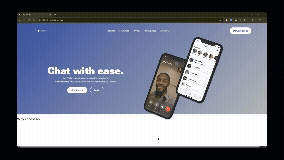

# HiChat - UI Engineering Practice

This repository documents my process of converting an early-stage UI design into a functional website as part of my **UI engineering practice**.

The focus is on translating **design intent into clean, semantic, and interactive frontend code**, rather than just replicating visuals.

---

## Purpose

- Practice design → code translation
- Build strong fundamentals in semantic HTML and scalable CSS
- Apply UI-engineering thinking to layout, typography, and interactions

---

## What This Repo Contains

- Semantic page structure (header, nav, sections)
- A responsive-ready navigation bar
- Button components with SVG icons
- Custom hover and micro-interaction patterns
- Delayed hero animations using CSS
- Thoughtful typography usage (design-driven)

---

## Tech Stack

- HTML5
- CSS3 (Flexbox, animations, transitions)
- No frameworks (intentional)

---

## Status

Work in progress.  
This repo will evolve as I continue refining layout, responsiveness, and interactions.

---

## Intent

This is a **learning-driven UI engineering project**, focused on writing clean, accessible, and maintainable frontend code.

---

## Preview

## Preview

[]
(https://www.youtube.com/watch?v=kiGibwaOitQ)
