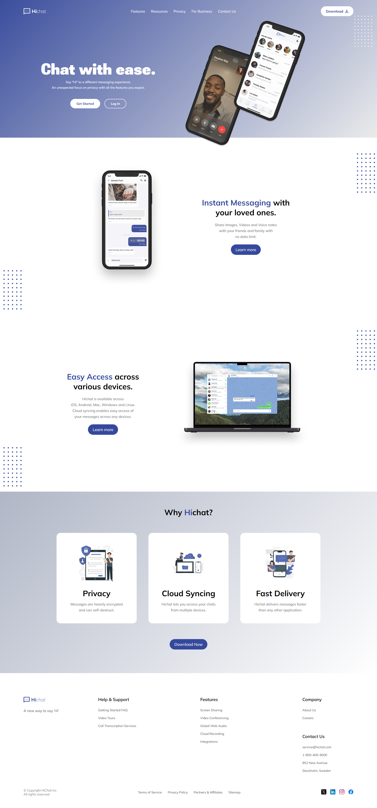

# HiChat – UI Engineering Project

This project represents the **complete implementation of a UI design into a fully functional website**, built as part of my journey toward becoming a **UI Engineer**.

Rather than just recreating visuals, the focus was on **translating design intent into clean, scalable, and maintainable code**, while paying close attention to layout behavior, spacing systems, and interaction details.

---

## 🚀 Overview

HiChat is a modern landing page for a messaging platform, designed and developed with an emphasis on:

- Clean visual hierarchy  
- Consistent spacing and layout systems  
- Smooth micro-interactions  
- Real-world UI engineering practices  

---

## 🎯 Objectives

- Bridge the gap between **UI/UX design and frontend development**
- Strengthen fundamentals in **semantic HTML and scalable CSS**
- Build layouts that are **robust, flexible, and production-ready**
- Develop an eye for **pixel accuracy and design consistency**

---

## 🧩 Features Implemented

- Semantic page structure (header, navigation, sections, footer)
- Fully structured hero section with animation
- Feature sections with alternating layouts
- Reusable button components with hover interactions
- Micro-interactions (hover states, transitions, elevation effects)
- Decorative UI elements (floating patterns, layered visuals)
- Clean flexbox-based layout system
- Typography system aligned with design intent

---

## 🛠 Tech Stack

- **HTML5**
- **CSS3**
  - Flexbox
  - Animations & transitions
- No frameworks (built intentionally from scratch)

---

## 🧠 Key Learnings

- Handling layout edge cases (like overflow and spacing bugs)
- Understanding how positioning affects real-world UI behavior
- Using Flexbox effectively for scalable layouts
- Translating static designs into responsive-friendly structures
- Thinking like a UI Engineer, not just a designer

---

## 📌 Project Status

✅ Completed (Initial Version)  
🔄 Future Improvements Planned:
- Full responsiveness across devices  
- Accessibility improvements  
- Performance optimizations  
- Advanced animations and interactions  

---

## 💡 Intent

This project is part of my **UI Engineering practice**, where I focus on building interfaces that are:

- Clean and maintainable  
- Visually consistent  
- Aligned with real-world product standards  

---

## 📸 Preview

---

## 🔗 Next Steps

I’ll continue refining this project while building more complex interfaces, moving toward:

- Design systems  
- Component-driven architecture  
- Advanced frontend interactions  

---

> This project reflects my transition from UI/UX design to **UI Engineering**, combining design thinking with implementation skills.